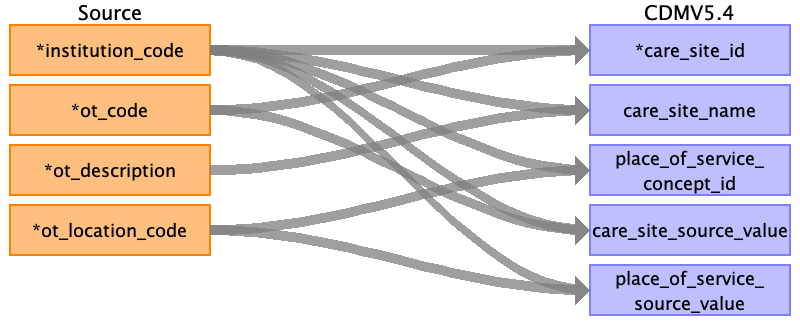
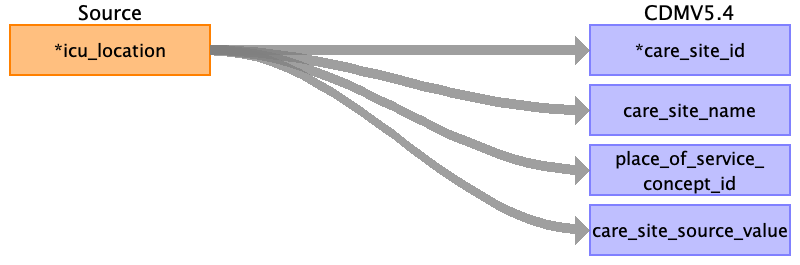

## Table name: care_site

### Reading from intra_op__operation

| Destination Field | Source field | Logic | Comment field |
| --- | --- | --- | --- |
| care_site_id | ot_code institution_code | Autogenerated unique number based on distinct value of ot_code in ascending order number based on alphabetical Autogenerated unique number based on distinct value of institution_code in ascending order number based on alphabetical |  |
| care_site_name | ot_description institution_code | care_site_name = ot_description care_site_name = 'SGH' | Example values in ot_description as ['Ambulatory Surgery Centre OT 3 (GA)']   |
| place_of_service_concept_id | ot_location_code institution_code | Obtain standard concept id based on ot_location_code    For operating theaters unable to be mapped: put concept id (8717, CMS Place of Service, Visit domain)  put concept id based on value in place_of_service_source_value    Concept id examples:  ASC -> 8883 (CMS Place of Service, Visit domain)  AEC -> 38004220 (NUCC, Visit domain)  MOT -> 8718 (CMS Place of Service, Visit domain)  NHC -> 581383 (CMS Place of Service, Visit domain)  CICU -> 581383 (CMS Place of Service, Visit domain)    --- Obtain standard concept id from institution_code    For hospital (SGH): put concept id (38004515, 'Inpatient Hospital', CMS Place of Service, Visit Domain) |  |
| location_id |  |  | no data; may skip for now |
| care_site_source_value | ot_code institution_code | care_site_source_value = ot_code    --- care_site_source_value = 'SGH' | Example VALUES in ot_code ['AES10', 'AS04', 'AS03']   |
| place_of_service_source_value | ot_location_code institution_code | place_of_service_source_value = ot_location_code    --- place_of_service_source_value = 'SGH' | Example VALUES in ot_location_code ['AEC', 'ASC']   |

### Reading from post_op__discharge

| Destination Field | Source field | Logic | Comment field |
| --- | --- | --- | --- |
| care_site_id | external_hospital_code |  |  |
| care_site_name | external_hospital_name |  |  |
| place_of_service_concept_id |  |  |  |
| location_id |  |  | no data; may skip for now |
| care_site_source_value | external_hospital_code |  |  |
| place_of_service_source_value |  |  |  |

### Reading from post_op__icu

| Destination Field | Source field | Logic | Comment field |
| --- | --- | --- | --- |
| care_site_id | icu_location |  | Autogenerated unique id  |
| care_site_name | icu_location |  |  |
| place_of_service_concept_id | icu_location | Obtain standard concept id based on icu_location    example concept id for 'CICU' value in icu_location is 581383 (Inpatient Cardiac Care Facility, CMS Place of Service, Visit domain) |  |
| location_id |  |  | no data; may skip for now |
| care_site_source_value | icu_location |  |  |
| place_of_service_source_value |  |  |  |

