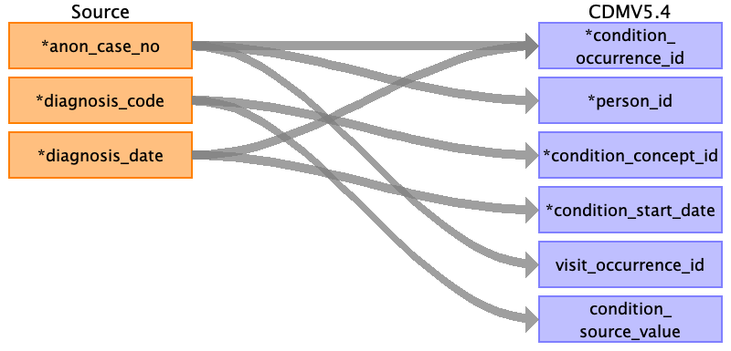

## Table name: condition_occurrence

### Reading from post_op__discharge

| Destination Field | Source field | Logic | Comment field |
| --- | --- | --- | --- |
| condition_occurrence_id | diagnosis_date id |  | Autogenerated unique ids order by ‘diagnosis_date’ and ‘id’. |
| person_id | anon_case_no | Joined with PERSON.PERSON_SOURCE_VALUE for PERSON.PERSON_ID |  |
| condition_concept_id | diagnosis_code | Mapped by source_to_concept_map table from vocab team |  |
| condition_start_date | diagnosis_date |  | Don't have actual condition_start_date in the data, so the diagnosis_date is used instead  |
| condition_start_datetime |  |  |  |
| condition_end_date |  |  |  |
| condition_end_datetime |  |  |  |
| condition_type_concept_id |  |  | 32879 for Registry |
| condition_status_concept_id |  |  | 32896 for Discharge diagnosis |
| stop_reason |  |  |  |
| provider_id |  |  |  |
| visit_occurrence_id | session_id |  |  |
| visit_detail_id |  |  |  |
| condition_source_value | diagnosis_code |  |  |
| condition_source_concept_id |  |  |  |
| condition_status_source_value |  |  |  |

