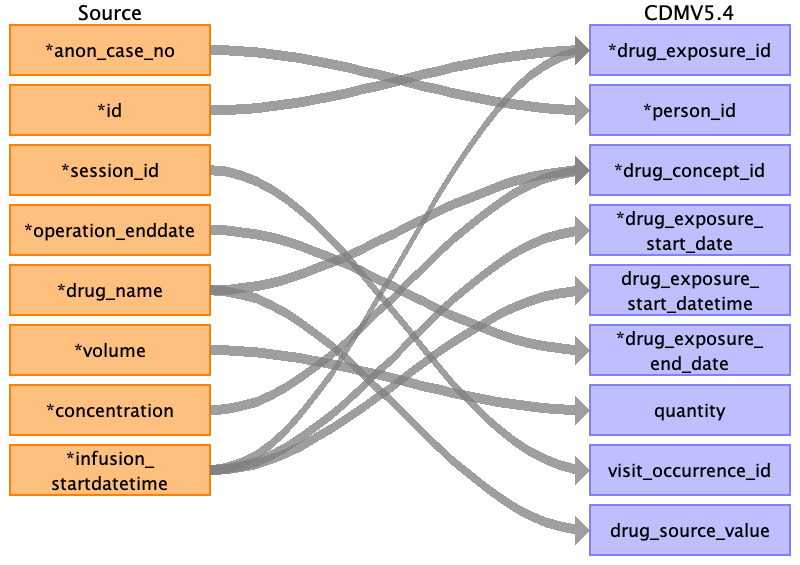

## Table name: condition_occurrence

### Reading from post_op__discharge

| Destination Field | Source field | Logic | Comment field |
| --- | --- | --- | --- |
| condition_occurrence_id | id diagnosis_date |  | Autogenerated unique ids, order by date then discharge id. |
| person_id | anon_case_no |  |  |
| condition_concept_id | diagnosis_code |  |  |
| condition_start_date |  |  |  |
| condition_start_datetime | diagnosis_date |  |  |
| condition_end_date |  |  |  |
| condition_end_datetime |  |  |  |
| condition_type_concept_id |  |  | 32879	Registry |
| condition_status_concept_id |  |  |  |
| stop_reason |  |  |  |
| provider_id |  |  |  |
| visit_occurrence_id |  |  |  |
| visit_detail_id |  |  |  |
| condition_source_value | diagnosis_code |  |  |
| condition_source_concept_id |  |  |  |
| condition_status_source_value |  |  |  |

