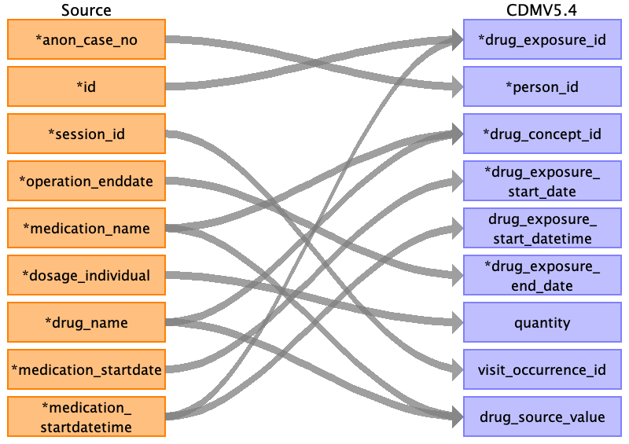

## Table name: death

### Reading from post_op__info

| Destination Field | Source field | Logic | Comment field |
| --- | --- | --- | --- |
| person_id | anon_case_no |  |  |
| death_date | death_date |  |  |
| death_datetime |  |  |  |
| death_type_concept_id |  |  | 32879	Registry |
| cause_concept_id |  |  |  |
| cause_source_value |  |  |  |
| cause_source_concept_id |  |  |  |

