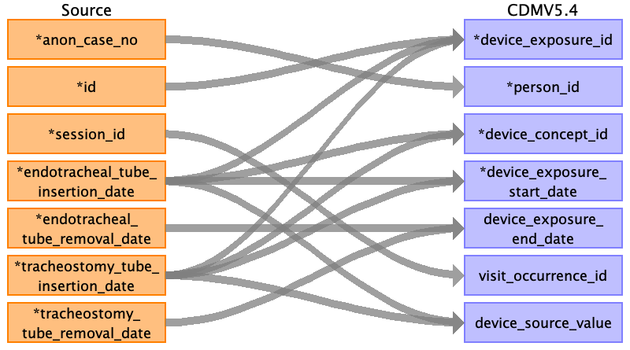
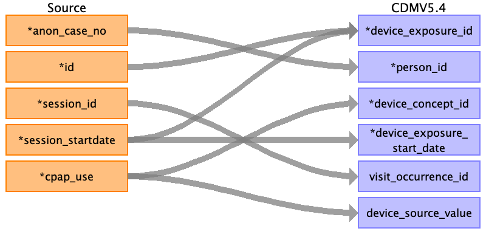

## Table name: device_exposure

### Reading from post_op__icu

| Destination Field | Source field | Logic | Comment field |
| --- | --- | --- | --- |
| device_exposure_id | id endotracheal_tube_insertion_date tracheostomy_tube_insertion_date |  | Autogenerated running id by ascending order of time and `id` |
| person_id | anon_case_no | Joined with PERSON.PERSON_SOURCE_VALUE for PERSON.PERSON_ID |  |
| device_concept_id | endotracheal_tube_insertion_date tracheostomy_tube_insertion_date |  |  |
| device_exposure_start_date | endotracheal_tube_insertion_date tracheostomy_tube_insertion_date |  |  |
| device_exposure_start_datetime |  |  |  |
| device_exposure_end_date | endotracheal_tube_removal_date tracheostomy_tube_removal_date |  |  |
| device_exposure_end_datetime |  |  |  |
| device_type_concept_id |  |  | 32879 for Registry |
| unique_device_id |  |  |  |
| production_id |  |  |  |
| quantity |  |  |  |
| provider_id |  |  |  |
| visit_occurrence_id | session_id |  |  |
| visit_detail_id |  |  |  |
| device_source_value | endotracheal_tube_insertion_date tracheostomy_tube_insertion_date | If value IS NOT NULL, then 'Endotracheal tube' If value IS NOT NULL, then 'Tracheostomy tube' |  |
| device_source_concept_id |  |  |  |
| unit_concept_id |  |  |  |
| unit_source_value |  |  |  |
| unit_source_concept_id |  |  |  |

### Reading from pre_op__risk_index

| Destination Field | Source field | Logic | Comment field |
| --- | --- | --- | --- |
| device_exposure_id | id session_startdate |  | Autogenerated running id by ascending order of time and `id` |
| person_id | anon_case_no | Joined with PERSON.PERSON_SOURCE_VALUE for PERSON.PERSON_ID |  |
| device_concept_id | cpap_use | Continuous Positive Airway Pressure : 2616666 |  |
| device_exposure_start_date | session_startdate |  |  |
| device_exposure_start_datetime |  |  |  |
| device_exposure_end_date |  |  |  |
| device_exposure_end_datetime |  |  |  |
| device_type_concept_id |  |  | 32879 for Registry |
| unique_device_id |  |  |  |
| production_id |  |  |  |
| quantity |  |  |  |
| provider_id |  |  |  |
| visit_occurrence_id | session_id |  |  |
| visit_detail_id |  |  |  |
| device_source_value | cpap_use | If NOT NULL, then 'CPAP'. |  |
| device_source_concept_id |  |  |  |
| unit_concept_id |  |  |  |
| unit_source_value |  |  |  |
| unit_source_concept_id |  |  |  |

