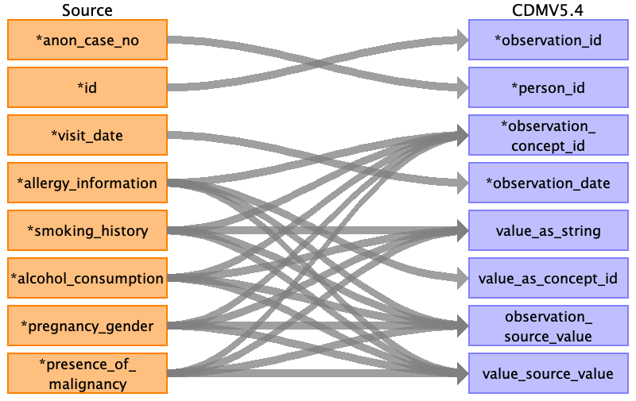
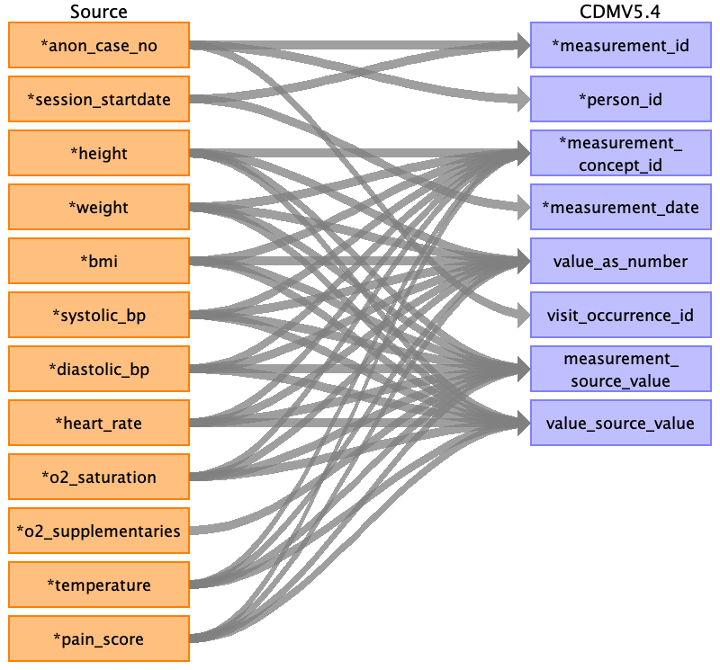
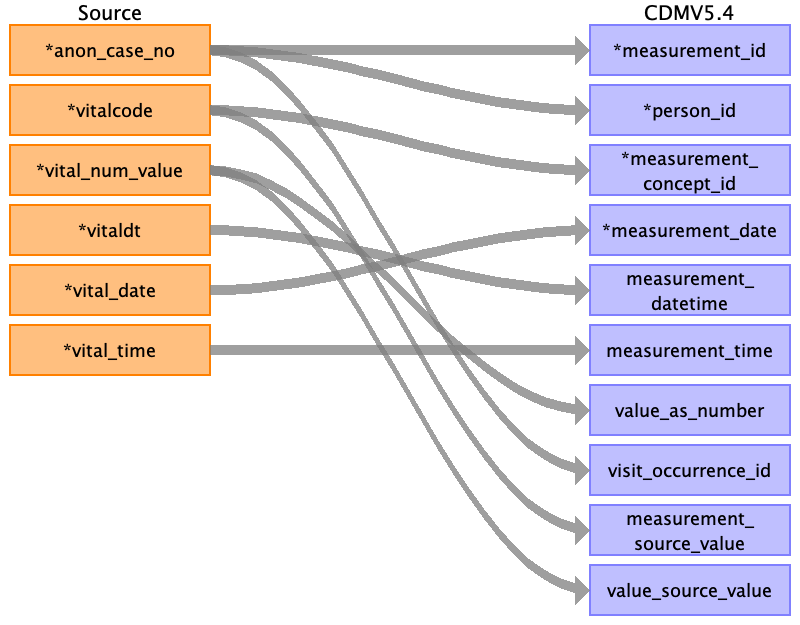

## Table name: drug_exposure

### Reading from intra_op__drug_drug

| Destination Field | Source field | Logic | Comment field |
| --- | --- | --- | --- |
| drug_exposure_id | id infusion_startdatetime |  | Autogenerated running id by ascending order of startdatetime and id |
| person_id | anon_case_no | Joined with PERSON.PERSON_SOURCE_VALUE for PERSON.PERSON_ID |  |
| drug_concept_id | drug_name concentration | Need mapping table from Vocab team  |  |
| drug_exposure_start_date | infusion_startdatetime |  |  |
| drug_exposure_start_datetime | infusion_startdatetime |  |  |
| drug_exposure_end_date | operation_enddate |  |  |
| drug_exposure_end_datetime |  |  |  |
| verbatim_end_date |  |  |  |
| drug_type_concept_id |  |  | 32879 for Registry |
| stop_reason |  |  |  |
| refills |  |  |  |
| quantity | volume |  |  |
| days_supply |  |  | If source data is from intra_op, drug is assumed to be given intra operation, day supply is likely be 1. |
| sig |  |  |  |
| route_concept_id |  |  |  |
| lot_number |  |  |  |
| provider_id |  |  |  |
| visit_occurrence_id | session_id |  |  |
| visit_detail_id |  |  |  |
| drug_source_value | drug_name |  |  |
| drug_source_concept_id |  |  |  |
| route_source_value |  |  |  |
| dose_unit_source_value |  |  |  |

### Reading from intra_op__drug_fluids

| Destination Field | Source field | Logic | Comment field |
| --- | --- | --- | --- |
| drug_exposure_id | id fluid_startdate fluid_starttime |  | Autogenerated running id by ascending order of startdatetime and id |
| person_id | anon_case_no | Joined with PERSON.PERSON_SOURCE_VALUE for PERSON.PERSON_ID |  |
| drug_concept_id | fluid_name drug_name | Need mapping table from Vocab team  |  |
| drug_exposure_start_date | fluid_startdate |  |  |
| drug_exposure_start_datetime | fluid_starttime fluid_startdate |  |  |
| drug_exposure_end_date | fluid_enddate |  |  |
| drug_exposure_end_datetime | fluid_endtime fluid_enddate |  |  |
| verbatim_end_date |  |  |  |
| drug_type_concept_id |  |  | 32879 for Registry |
| stop_reason |  |  |  |
| refills |  |  |  |
| quantity | fluid_volume_actual |  |  |
| days_supply |  |  | If source data is from intra_op, drug is assumed to be given intra operation, day supply is likely be 1. |
| sig |  |  |  |
| route_concept_id |  |  |  |
| lot_number |  |  |  |
| provider_id |  |  |  |
| visit_occurrence_id | session_id |  |  |
| visit_detail_id |  |  |  |
| drug_source_value | drug_name fluid_name |  |  |
| drug_source_concept_id |  |  |  |
| route_source_value |  |  |  |
| dose_unit_source_value |  |  |  |

### Reading from intra_op__drug_med

| Destination Field | Source field | Logic | Comment field |
| --- | --- | --- | --- |
| drug_exposure_id | id medication_startdatetime |  | Autogenerated running id by ascending order of startdatetime and id |
| person_id | anon_case_no | Joined with PERSON.PERSON_SOURCE_VALUE for PERSON.PERSON_ID |  |
| drug_concept_id | drug_name medication_name | Need mapping table from Vocab team Need mapping table from Vocab team |  |
| drug_exposure_start_date | medication_startdate |  |  |
| drug_exposure_start_datetime | medication_startdatetime |  |  |
| drug_exposure_end_date | operation_enddate |  |  |
| drug_exposure_end_datetime |  |  |  |
| verbatim_end_date |  |  |  |
| drug_type_concept_id |  |  | 32879 for Registry |
| stop_reason |  |  |  |
| refills |  |  |  |
| quantity | dosage_individual |  |  |
| days_supply |  |  | If source data is from intra_op, drug is assumed to be given intra operation, day supply is likely be 1. |
| sig |  |  |  |
| route_concept_id |  |  |  |
| lot_number |  |  |  |
| provider_id |  |  |  |
| visit_occurrence_id | session_id |  |  |
| visit_detail_id |  |  |  |
| drug_source_value | medication_name drug_name |  |  |
| drug_source_concept_id |  |  |  |
| route_source_value |  |  |  |
| dose_unit_source_value |  |  |  |

