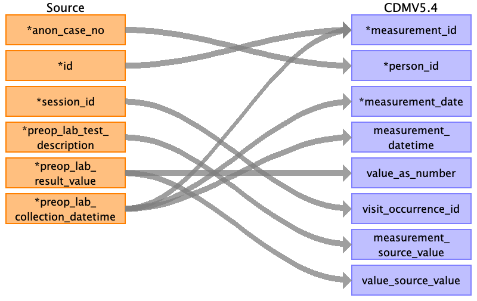
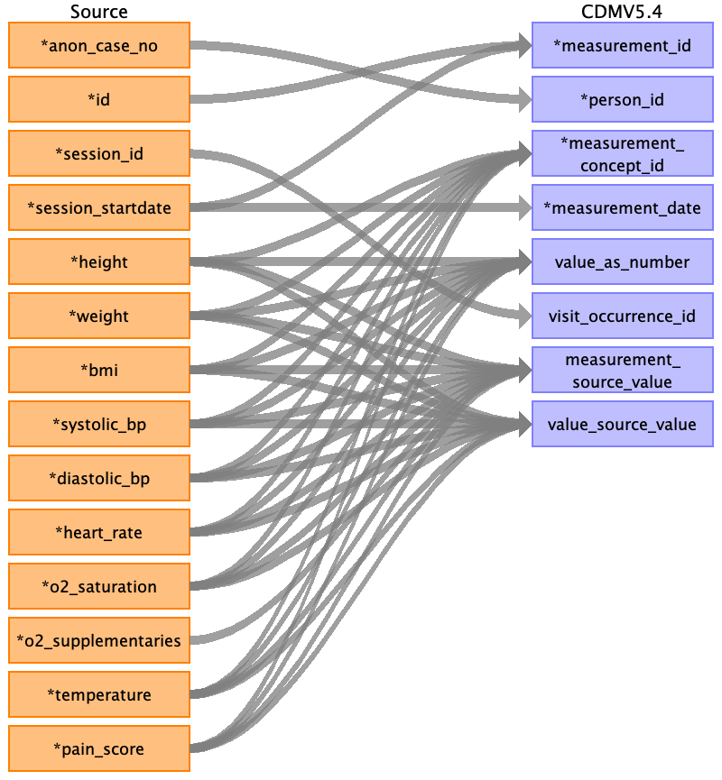
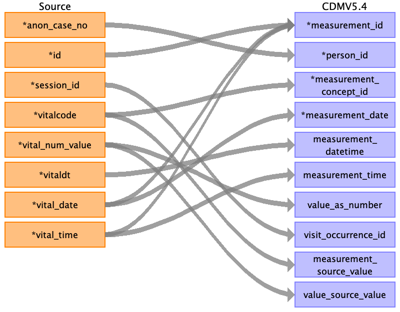
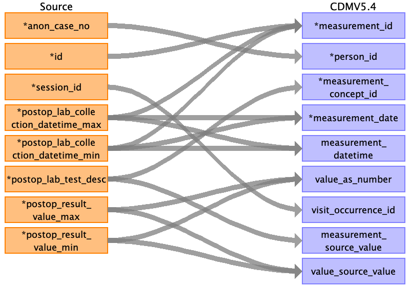
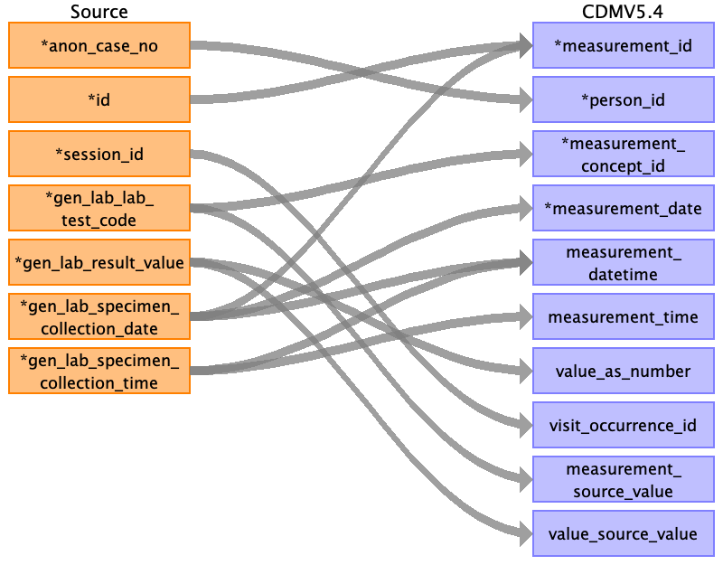
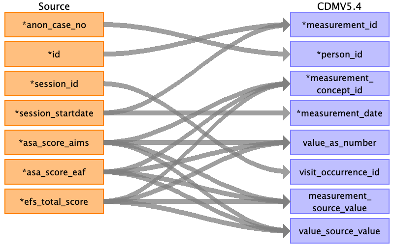
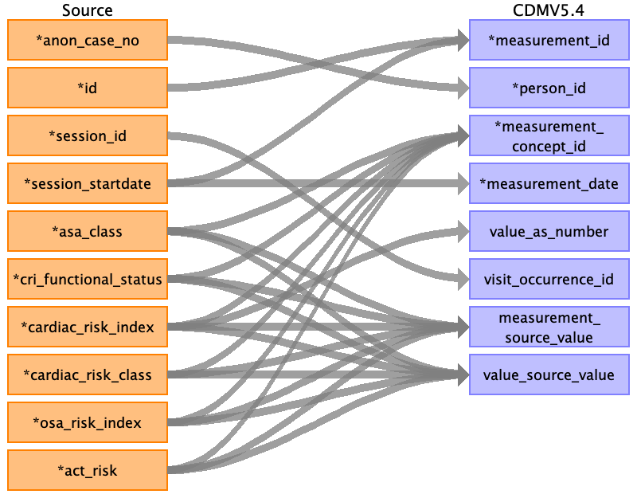
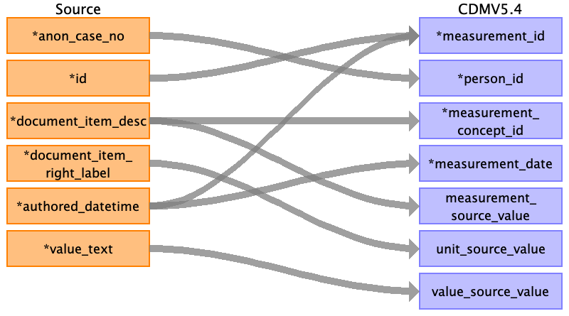

## Table name: measurement

### Reading from pre_op__lab

| Destination Field | Source field | Logic | Comment field |
| --- | --- | --- | --- |
| measurement_id | preop_lab_collection_datetime id |  | Autogenerated id by time and id |
| person_id | anon_case_no | Joined with PERSON.PERSON_SOURCE_VALUE for PERSON.PERSON_ID |  |
| measurement_concept_id |  |  |  |
| measurement_date | preop_lab_collection_datetime |  |  |
| measurement_datetime | preop_lab_collection_datetime |  |  |
| measurement_time |  |  |  |
| measurement_type_concept_id |  |  | 32879 for Registry |
| operator_concept_id |  |  |  |
| value_as_number | preop_lab_result_value |  |  |
| value_as_concept_id |  |  |  |
| unit_concept_id |  |  |  |
| range_low |  |  |  |
| range_high |  |  |  |
| provider_id |  |  |  |
| visit_occurrence_id | session_id |  |  |
| visit_detail_id |  |  |  |
| measurement_source_value | preop_lab_test_description |  | Put the name of measurement/lab/score here |
| measurement_source_concept_id |  |  |  |
| unit_source_value |  |  |  |
| unit_source_concept_id |  |  |  |
| value_source_value | preop_lab_result_value |  | Put the source value of measurement/lab/score here |
| measurement_event_id |  |  |  |
| meas_event_field_concept_id |  |  |  |

### Reading from pre_op__char

| Destination Field | Source field | Logic | Comment field |
| --- | --- | --- | --- |
| measurement_id | id session_startdate |  | Autogenerated id by time and id |
| person_id | anon_case_no |  |  |
| measurement_concept_id | height weight bmi systolic_bp diastolic_bp heart_rate o2_saturation temperature pain_score | height -> 607590;    weight -> 4099154;    bmi -> 4245997;    sbp -> 4152194;    dbp -> 4154790;    heart_rate -> 3027018;    temperature -> 3020891;         |  |
| measurement_date | session_startdate |  |  |
| measurement_datetime |  |  |  |
| measurement_time |  |  |  |
| measurement_type_concept_id |  |  | 32879 for Registry |
| operator_concept_id |  |  |  |
| value_as_number | height weight bmi systolic_bp diastolic_bp heart_rate o2_saturation temperature pain_score |  |  |
| value_as_concept_id |  |  |  |
| unit_concept_id |  |  |  |
| range_low |  |  |  |
| range_high |  |  |  |
| provider_id |  |  |  |
| visit_occurrence_id | session_id |  |  |
| visit_detail_id |  |  |  |
| measurement_source_value | height weight bmi systolic_bp diastolic_bp heart_rate o2_saturation o2_supplementaries temperature pain_score |  | Put the name of measurement/lab/score here |
| measurement_source_concept_id |  |  |  |
| unit_source_value |  |  |  |
| unit_source_concept_id |  |  |  |
| value_source_value | o2_saturation heart_rate diastolic_bp systolic_bp bmi weight height temperature pain_score |  | Put the source value of measurement/lab/score here |
| measurement_event_id |  |  |  |
| meas_event_field_concept_id |  |  |  |

### Reading from intra_op__aims_vitals

| Destination Field | Source field | Logic | Comment field |
| --- | --- | --- | --- |
| measurement_id | id vital_date vital_time |  | Autogenerated id by time and id |
| person_id | anon_case_no |  |  |
| measurement_concept_id | vitalcode | Mapping table from vocab team |  |
| measurement_date | vital_date |  |  |
| measurement_datetime | vitaldt |  |  |
| measurement_time | vital_time |  |  |
| measurement_type_concept_id |  |  | 32879 for Registry |
| operator_concept_id |  |  |  |
| value_as_number | vital_num_value |  |  |
| value_as_concept_id |  |  |  |
| unit_concept_id |  |  |  |
| range_low |  |  |  |
| range_high |  |  |  |
| provider_id |  |  |  |
| visit_occurrence_id | session_id |  |  |
| visit_detail_id |  |  |  |
| measurement_source_value | vitalcode |  | Put the name of measurement/lab/score here |
| measurement_source_concept_id |  |  |  |
| unit_source_value |  |  |  |
| unit_source_concept_id |  |  |  |
| value_source_value | vital_num_value |  | Put the source value of measurement/lab/score here |
| measurement_event_id |  |  |  |
| meas_event_field_concept_id |  |  |  |

### Reading from intra_op__operation

| Destination Field | Source field | Logic | Comment field |
| --- | --- | --- | --- |
| measurement_id | anon_case_no vital_signs_taken_time |  | Autogenerated id by time and id |
| person_id | anon_case_no |  |  |
| measurement_concept_id | vital_code | Mapping by vocab team |  |
| measurement_date | vital_signs_taken_date |  |  |
| measurement_datetime | vital_signs_taken_datetime |  |  |
| measurement_time | vital_signs_taken_time |  |  |
| measurement_type_concept_id |  |  | 32879 for Registry |
| operator_concept_id |  |  |  |
| value_as_number | vital_signs_result |  |  |
| value_as_concept_id |  |  |  |
| unit_concept_id |  |  |  |
| range_low |  |  |  |
| range_high |  |  |  |
| provider_id |  |  |  |
| visit_occurrence_id | anon_case_no |  |  |
| visit_detail_id |  |  |  |
| measurement_source_value | vital_code |  | Put the name of measurement/lab/score here |
| measurement_source_concept_id |  |  |  |
| unit_source_value |  |  |  |
| unit_source_concept_id |  |  |  |
| value_source_value | vital_signs_result |  | Put the source value of measurement/lab/score here |
| measurement_event_id |  |  |  |
| meas_event_field_concept_id |  |  |  |

### Reading from post_op__lab

| Destination Field | Source field | Logic | Comment field |
| --- | --- | --- | --- |
| measurement_id | postop_lab_collection_datetime_max postop_lab_collection_datetime_min id |  | Autogenerated id by time and id |
| person_id | anon_case_no |  |  |
| measurement_concept_id | postop_lab_test_desc | Mapping by vocab team |  |
| measurement_date | postop_lab_collection_datetime_max postop_lab_collection_datetime_min |  |  |
| measurement_datetime | postop_lab_collection_datetime_max postop_lab_collection_datetime_min |  |  |
| measurement_time |  |  |  |
| measurement_type_concept_id |  |  | 32879 for Registry |
| operator_concept_id |  |  |  |
| value_as_number | postop_result_value_max postop_result_value_min |  |  |
| value_as_concept_id |  |  |  |
| unit_concept_id |  |  |  |
| range_low |  |  |  |
| range_high |  |  |  |
| provider_id |  |  |  |
| visit_occurrence_id | session_id |  |  |
| visit_detail_id |  |  |  |
| measurement_source_value | postop_lab_test_desc |  | Put the name of measurement/lab/score here |
| measurement_source_concept_id |  |  |  |
| unit_source_value |  |  |  |
| unit_source_concept_id |  |  |  |
| value_source_value | postop_result_value_max postop_result_value_min |  | Put the source value of measurement/lab/score here |
| measurement_event_id |  |  |  |
| meas_event_field_concept_id |  |  |  |

### Reading from post_op__labs_all

| Destination Field | Source field | Logic | Comment field |
| --- | --- | --- | --- |
| measurement_id | id gen_lab_specimen_collection_date |  | Autogenerated id by time and id |
| person_id | anon_case_no |  |  |
| measurement_concept_id | gen_lab_lab_test_code |  |  |
| measurement_date | gen_lab_specimen_collection_date |  |  |
| measurement_datetime | gen_lab_specimen_collection_time gen_lab_specimen_collection_date |  |  |
| measurement_time | gen_lab_specimen_collection_time |  |  |
| measurement_type_concept_id |  |  | 32879 for Registry |
| operator_concept_id |  |  |  |
| value_as_number | gen_lab_result_value |  |  |
| value_as_concept_id |  |  |  |
| unit_concept_id |  |  |  |
| range_low |  |  |  |
| range_high |  |  |  |
| provider_id |  |  |  |
| visit_occurrence_id | session_id |  |  |
| visit_detail_id |  |  |  |
| measurement_source_value | gen_lab_lab_test_code |  | Put the name of measurement/lab/score here |
| measurement_source_concept_id |  |  |  |
| unit_source_value |  |  |  |
| unit_source_concept_id |  |  |  |
| value_source_value | gen_lab_result_value |  | Put the source value of measurement/lab/score here |
| measurement_event_id |  |  |  |
| meas_event_field_concept_id |  |  |  |

### Reading from pre_op__others

| Destination Field | Source field | Logic | Comment field |
| --- | --- | --- | --- |
| measurement_id | session_startdate id |  | Autogenerated id by time and id |
| person_id | anon_case_no |  |  |
| measurement_concept_id | efs_total_score asa_score_aims asa_score_eaf | 44809525 4159411 4159411 |  |
| measurement_date | session_startdate |  |  |
| measurement_datetime |  |  |  |
| measurement_time |  |  |  |
| measurement_type_concept_id |  |  | 32879 for Registry |
| operator_concept_id |  |  |  |
| value_as_number | asa_score_aims asa_score_eaf efs_total_score |  |  |
| value_as_concept_id |  |  |  |
| unit_concept_id |  |  |  |
| range_low |  |  |  |
| range_high |  |  |  |
| provider_id |  |  |  |
| visit_occurrence_id | session_id |  |  |
| visit_detail_id |  |  |  |
| measurement_source_value | efs_total_score asa_score_aims asa_score_eaf |  | Put the name of measurement/lab/score here |
| measurement_source_concept_id |  |  |  |
| unit_source_value |  |  |  |
| unit_source_concept_id |  |  |  |
| value_source_value | asa_score_aims asa_score_eaf efs_total_score |  | Put the source value of measurement/lab/score here |
| measurement_event_id |  |  |  |
| meas_event_field_concept_id |  |  |  |

### Reading from pre_op__risk_index

| Destination Field | Source field | Logic | Comment field |
| --- | --- | --- | --- |
| measurement_id | id session_startdate |  | Autogenerated id by time and id |
| person_id | anon_case_no |  |  |
| measurement_concept_id | asa_class cri_functional_status cardiac_risk_index cardiac_risk_class osa_risk_index act_risk |  |  |
| measurement_date | session_startdate |  |  |
| measurement_datetime |  |  |  |
| measurement_time |  |  |  |
| measurement_type_concept_id |  |  | 32879 for Registry |
| operator_concept_id |  |  |  |
| value_as_number | cardiac_risk_index |  |  |
| value_as_concept_id |  |  |  |
| unit_concept_id |  |  |  |
| range_low |  |  |  |
| range_high |  |  |  |
| provider_id |  |  |  |
| visit_occurrence_id | session_id |  |  |
| visit_detail_id |  |  |  |
| measurement_source_value | asa_class cri_functional_status cardiac_risk_index cardiac_risk_class osa_risk_index act_risk |  | Put the name of measurement/lab/score here |
| measurement_source_concept_id |  |  |  |
| unit_source_value |  |  |  |
| unit_source_concept_id |  |  |  |
| value_source_value | asa_class cri_functional_status cardiac_risk_index cardiac_risk_class osa_risk_index act_risk |  | Put the source value of measurement/lab/score here |
| measurement_event_id |  |  |  |
| meas_event_field_concept_id |  |  |  |

### Reading from intra_op__nur_vitals

| Destination Field | Source field | Logic | Comment field |
| --- | --- | --- | --- |
| measurement_id | authored_datetime id |  | Autogenerated id by time and id |
| person_id | anon_case_no |  |  |
| measurement_concept_id | document_item_desc |  |  |
| measurement_date | authored_datetime |  |  |
| measurement_datetime |  |  |  |
| measurement_time |  |  |  |
| measurement_type_concept_id |  |  | 32879 for Registry |
| operator_concept_id |  |  |  |
| value_as_number |  |  |  |
| value_as_concept_id |  |  |  |
| unit_concept_id |  |  |  |
| range_low |  |  |  |
| range_high |  |  |  |
| provider_id |  |  |  |
| visit_occurrence_id |  |  |  |
| visit_detail_id |  |  |  |
| measurement_source_value | document_item_desc |  | Put the name of measurement/lab/score here |
| measurement_source_concept_id |  |  |  |
| unit_source_value | document_item_right_label |  |  |
| unit_source_concept_id |  |  |  |
| value_source_value | value_text |  | Put the source value of measurement/lab/score here |
| measurement_event_id |  |  |  |
| meas_event_field_concept_id |  |  |  |

