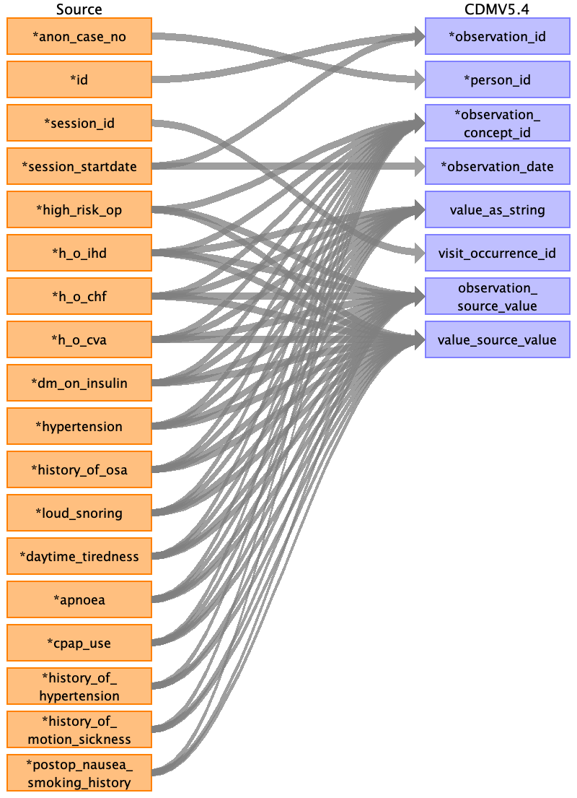
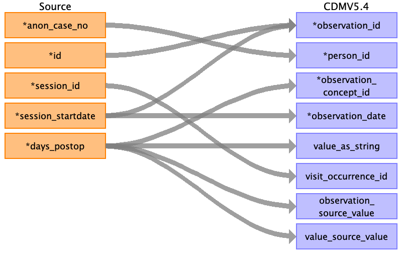
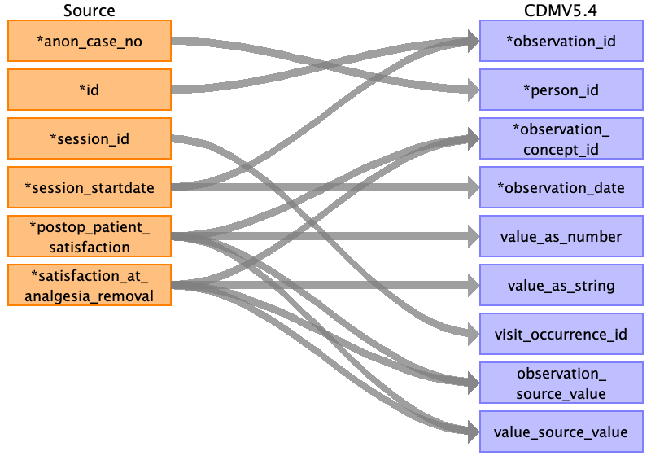

## Table name: observation

### Reading from pre_op__risk_index

| Destination Field | Source field | Logic | Comment field |
| --- | --- | --- | --- |
| observation_id | session_startdate id |  | Autogenerated running id by ascending order of `session_startdate` and `id` |
| person_id | anon_case_no | Joined with PERSON.PERSON_SOURCE_VALUE for PERSON.PERSON_ID |  |
| observation_concept_id | high_risk_op h_o_ihd h_o_chf h_o_cva dm_on_insulin hypertension history_of_osa loud_snoring daytime_tiredness apnoea cpap_use history_of_hypertension history_of_motion_sickness postop_nausea_smoking_history |  | Need standard concept ids for these observation from vocab mapping team |
| observation_date | session_startdate |  |  |
| observation_datetime |  |  |  |
| observation_type_concept_id |  |  | 32879 for Registry |
| value_as_number |  |  |  |
| value_as_string | h_o_ihd h_o_chf h_o_cva dm_on_insulin hypertension history_of_osa loud_snoring daytime_tiredness apnoea cpap_use |  | Put the string value of observation here |
| value_as_concept_id |  |  |  |
| qualifier_concept_id |  |  |  |
| unit_concept_id |  |  |  |
| provider_id |  |  |  |
| visit_occurrence_id | session_id |  |  |
| visit_detail_id |  |  |  |
| observation_source_value | high_risk_op h_o_ihd h_o_chf h_o_cva dm_on_insulin hypertension history_of_osa loud_snoring daytime_tiredness apnoea cpap_use history_of_hypertension history_of_motion_sickness postop_nausea_smoking_history |  | Put the name of observation here |
| observation_source_concept_id |  |  |  |
| unit_source_value |  |  |  |
| qualifier_source_value |  |  |  |
| value_source_value | high_risk_op h_o_ihd h_o_chf h_o_cva dm_on_insulin hypertension history_of_osa loud_snoring daytime_tiredness apnoea cpap_use history_of_hypertension history_of_motion_sickness postop_nausea_smoking_history |  | Put the source value of observation here |
| observation_event_id |  |  |  |
| obs_event_field_concept_id |  |  |  |

### Reading from pre_op__others

| Destination Field | Source field | Logic | Comment field |
| --- | --- | --- | --- |
| observation_id | session_startdate id |  | Autogenerated running id by ascending order of `session_startdate` and `id` |
| person_id | anon_case_no | Joined with PERSON.PERSON_SOURCE_VALUE for PERSON.PERSON_ID |  |
| observation_concept_id | forget_prescribed_medications no_of_prior_hospital_admissions continence |  | Need standard concept ids for these observation from vocab mapping team |
| observation_date | session_startdate |  |  |
| observation_datetime |  |  |  |
| observation_type_concept_id |  |  | 32879 for Registry |
| value_as_number |  |  |  |
| value_as_string | forget_prescribed_medications continence no_of_prior_hospital_admissions inhalation_burns tbsa |  | Put the string value of observation here |
| value_as_concept_id |  |  |  |
| qualifier_concept_id |  |  |  |
| unit_concept_id |  |  |  |
| provider_id |  |  |  |
| visit_occurrence_id | session_id |  |  |
| visit_detail_id |  |  |  |
| observation_source_value | forget_prescribed_medications no_of_prior_hospital_admissions continence inhalation_burns tbsa |  | Put the name of observation here |
| observation_source_concept_id |  |  |  |
| unit_source_value |  |  |  |
| qualifier_source_value |  |  |  |
| value_source_value | forget_prescribed_medications no_of_prior_hospital_admissions continence inhalation_burns tbsa |  | Put the source value of observation here |
| observation_event_id |  |  |  |
| obs_event_field_concept_id |  |  |  |

### Reading from pre_op__char

| Destination Field | Source field | Logic | Comment field |
| --- | --- | --- | --- |
| observation_id | session_startdate id |  | Autogenerated running id by ascending order of `session_startdate` and `id` |
| person_id | anon_case_no | Joined with PERSON.PERSON_SOURCE_VALUE for PERSON.PERSON_ID |  |
| observation_concept_id | smoking_history alcohol_consumption pregnancy_gender presence_of_malignancy allergy_information physical_general physical_cardio physical_respiratory |  | Need standard concept ids for these observation from vocab mapping team |
| observation_date | session_startdate |  |  |
| observation_datetime |  |  |  |
| observation_type_concept_id |  |  | 32879 for Registry |
| value_as_number |  |  |  |
| value_as_string | smoking_history pregnancy_gender alcohol_consumption presence_of_malignancy |  | Put the string value of observation here |
| value_as_concept_id | allergy_information |  | Put standard id for drug allergy here, e.g., 4241527 for Allergy to sulfonamide  |
| qualifier_concept_id |  |  |  |
| unit_concept_id |  |  |  |
| provider_id |  |  |  |
| visit_occurrence_id | session_id |  |  |
| visit_detail_id |  |  |  |
| observation_source_value | smoking_history alcohol_consumption pregnancy_gender presence_of_malignancy allergy_information physical_general physical_cardio physical_respiratory |  | Put the name of observation here |
| observation_source_concept_id |  |  |  |
| unit_source_value |  |  |  |
| qualifier_source_value |  |  |  |
| value_source_value | allergy_information smoking_history alcohol_consumption pregnancy_gender presence_of_malignancy physical_general physical_cardio physical_respiratory |  | Put the source value of observation here |
| observation_event_id |  |  |  |
| obs_event_field_concept_id |  |  |  |

### Reading from post_op__discharge

| Destination Field | Source field | Logic | Comment field |
| --- | --- | --- | --- |
| observation_id | session_startdate id |  | Autogenerated running id by ascending order of `session_startdate` and `id` |
| person_id | anon_case_no |  |  |
| observation_concept_id | days_postop |  | Need standard concept ids for these observation from vocab mapping team |
| observation_date | session_startdate |  |  |
| observation_datetime |  |  |  |
| observation_type_concept_id |  |  | 32879 for Registry |
| value_as_number |  |  |  |
| value_as_string | days_postop |  | Put the string value of observation here |
| value_as_concept_id |  |  |  |
| qualifier_concept_id |  |  |  |
| unit_concept_id |  |  |  |
| provider_id |  |  |  |
| visit_occurrence_id | session_id |  |  |
| visit_detail_id |  |  |  |
| observation_source_value | days_postop |  | Put the name of observation here |
| observation_source_concept_id |  |  |  |
| unit_source_value |  |  |  |
| qualifier_source_value |  |  |  |
| value_source_value | days_postop |  | Put the source value of observation here |
| observation_event_id |  |  |  |
| obs_event_field_concept_id |  |  |  |

### Reading from post_op__info

| Destination Field | Source field | Logic | Comment field |
| --- | --- | --- | --- |
| observation_id | session_startdate id |  | Autogenerated running id by ascending order of `session_startdate` and `id` |
| person_id | anon_case_no |  |  |
| observation_concept_id | postop_patient_satisfaction satisfaction_at_analgesia_removal |  | Need standard concept ids for these observation from vocab mapping team |
| observation_date | session_startdate |  |  |
| observation_datetime |  |  |  |
| observation_type_concept_id |  |  | 32879 for Registry |
| value_as_number | postop_patient_satisfaction |  |  |
| value_as_string | satisfaction_at_analgesia_removal |  | Put the string value of observation here |
| value_as_concept_id |  |  |  |
| qualifier_concept_id |  |  |  |
| unit_concept_id |  |  |  |
| provider_id |  |  |  |
| visit_occurrence_id | session_id |  |  |
| visit_detail_id |  |  |  |
| observation_source_value | postop_patient_satisfaction satisfaction_at_analgesia_removal |  | Put the name of observation here |
| observation_source_concept_id |  |  |  |
| unit_source_value |  |  |  |
| qualifier_source_value |  |  |  |
| value_source_value | postop_patient_satisfaction satisfaction_at_analgesia_removal |  | Put the source value of observation here |
| observation_event_id |  |  |  |
| obs_event_field_concept_id |  |  |  |

### Reading from post_op__icu

| Destination Field | Source field | Logic | Comment field |
| --- | --- | --- | --- |
| observation_id | session_startdate id |  | Autogenerated running id by ascending order of `session_startdate` and `id` |
| person_id | anon_case_no |  |  |
| observation_concept_id | resuscitation_status |  | Need standard concept ids for these observation from vocab mapping team |
| observation_date | session_startdate |  |  |
| observation_datetime |  |  |  |
| observation_type_concept_id |  |  | 32879 for Registry |
| value_as_number |  |  |  |
| value_as_string | resuscitation_status |  | Put the string value of observation here |
| value_as_concept_id |  |  |  |
| qualifier_concept_id |  |  |  |
| unit_concept_id |  |  |  |
| provider_id |  |  |  |
| visit_occurrence_id | session_id |  |  |
| visit_detail_id |  |  |  |
| observation_source_value | resuscitation_status |  | Put the name of observation here |
| observation_source_concept_id |  |  |  |
| unit_source_value |  |  |  |
| qualifier_source_value |  |  |  |
| value_source_value | resuscitation_status |  | Put the source value of observation here |
| observation_event_id |  |  |  |
| obs_event_field_concept_id |  |  |  |

