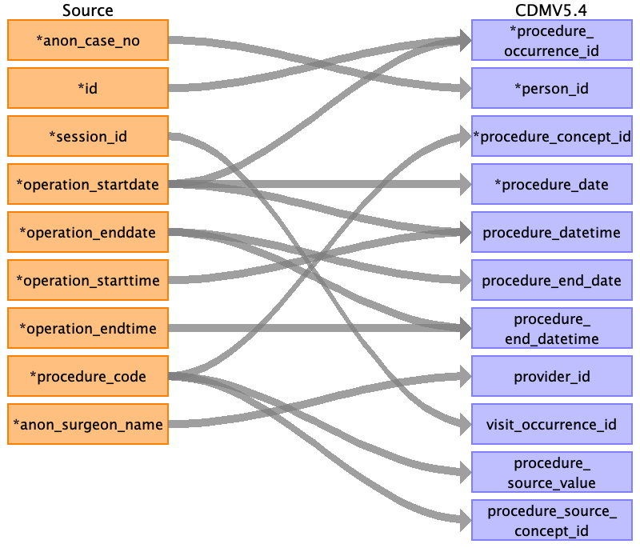

## Table name: observation

### Reading from pre_op__risk_index

| Destination Field | Source field | Logic | Comment field |
| --- | --- | --- | --- |
| observation_id | id |  |  |
| person_id | anon_case_no |  |  |
| observation_concept_id | high_risk_op h_o_ihd h_o_chf h_o_cva dm_on_insulin asa_class cri_functional_status cardiac_risk_index cardiac_risk_class hypertension history_of_osa loud_snoring daytime_tiredness apnoea |  |  |
| observation_date | session_startdate |  |  |
| observation_datetime |  |  |  |
| observation_type_concept_id |  |  |  |
| value_as_number | cardiac_risk_index |  |  |
| value_as_string | h_o_ihd h_o_chf h_o_cva dm_on_insulin asa_class cri_functional_status cardiac_risk_class hypertension history_of_osa loud_snoring daytime_tiredness apnoea |  |  |
| value_as_concept_id |  |  |  |
| qualifier_concept_id |  |  |  |
| unit_concept_id |  |  |  |
| provider_id |  |  |  |
| visit_occurrence_id |  |  |  |
| visit_detail_id |  |  |  |
| observation_source_value | high_risk_op h_o_ihd h_o_chf h_o_cva dm_on_insulin asa_class cri_functional_status cardiac_risk_index cardiac_risk_class hypertension history_of_osa loud_snoring daytime_tiredness apnoea |  |  |
| observation_source_concept_id |  |  |  |
| unit_source_value |  |  |  |
| qualifier_source_value |  |  |  |
| value_source_value |  |  |  |
| observation_event_id |  |  |  |
| obs_event_field_concept_id |  |  |  |

### Reading from pre_op__others

| Destination Field | Source field | Logic | Comment field |
| --- | --- | --- | --- |
| observation_id | id |  |  |
| person_id | anon_case_no |  |  |
| observation_concept_id | forget_prescribed_medications no_of_prior_hospital_admissions continence |  |  |
| observation_date | session_startdate |  |  |
| observation_datetime |  |  |  |
| observation_type_concept_id |  |  |  |
| value_as_number | no_of_prior_hospital_admissions |  |  |
| value_as_string | forget_prescribed_medications continence |  |  |
| value_as_concept_id |  |  |  |
| qualifier_concept_id |  |  |  |
| unit_concept_id |  |  |  |
| provider_id |  |  |  |
| visit_occurrence_id |  |  |  |
| visit_detail_id |  |  |  |
| observation_source_value | forget_prescribed_medications no_of_prior_hospital_admissions continence |  |  |
| observation_source_concept_id |  |  |  |
| unit_source_value |  |  |  |
| qualifier_source_value |  |  |  |
| value_source_value | forget_prescribed_medications no_of_prior_hospital_admissions continence |  |  |
| observation_event_id |  |  |  |
| obs_event_field_concept_id |  |  |  |

### Reading from pre_op__char

| Destination Field | Source field | Logic | Comment field |
| --- | --- | --- | --- |
| observation_id | id |  |  |
| person_id | anon_case_no |  |  |
| observation_concept_id | smoking_history alcohol_consumption pregnancy_gender presence_of_malignancy allergy_information |  |  |
| observation_date | visit_date |  |  |
| observation_datetime |  |  |  |
| observation_type_concept_id |  |  |  |
| value_as_number |  |  |  |
| value_as_string | smoking_history pregnancy_gender alcohol_consumption presence_of_malignancy |  |  |
| value_as_concept_id | allergy_information |  |  |
| qualifier_concept_id |  |  |  |
| unit_concept_id |  |  |  |
| provider_id |  |  |  |
| visit_occurrence_id |  |  |  |
| visit_detail_id |  |  |  |
| observation_source_value | smoking_history alcohol_consumption pregnancy_gender presence_of_malignancy allergy_information |  |  |
| observation_source_concept_id |  |  |  |
| unit_source_value |  |  |  |
| qualifier_source_value |  |  |  |
| value_source_value | allergy_information smoking_history alcohol_consumption pregnancy_gender presence_of_malignancy |  |  |
| observation_event_id |  |  |  |
| obs_event_field_concept_id |  |  |  |

