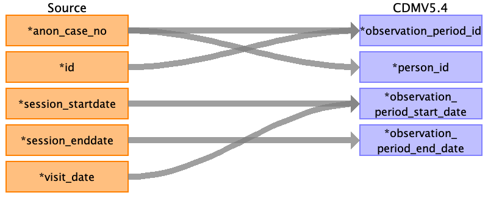
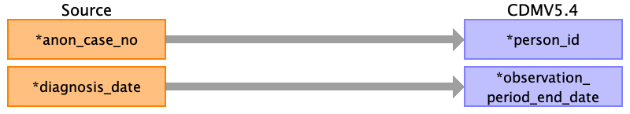
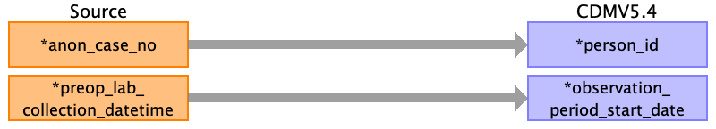

## Table name: observation_period

### Reading from pre_op__char

| Destination Field | Source field | Logic | Comment field |
| --- | --- | --- | --- |
| observation_period_id | id session_startdate |  | Autogenerated unique ids order by ‘session_startdate’ and ‘id’. |
| person_id | anon_case_no | Joined with PERSON.PERSON_SOURCE_VALUE for PERSON.PERSON_ID |  |
| observation_period_start_date | session_startdate visit_date |  | Min of the below start date as    Common variables in each table - Operation_StartDate,    post_op.discharge - Diagnosis_Date,    intra_op.operation - Vital_Signs_Taken_Date,    intra_op.aims_vitals - VITAL_DATE,    post_op.lab_micro - Reported_Date,    post_op.icu - Resuscitation_All_Data_Authored_Date,    post_op.renal - crrt_authored_date, |
| observation_period_end_date | session_enddate |  | Maximum of the below date:  Common variables in each table - Operation_EndDate,    post_op.icu - ICU_Discharge_Date,    post_op.info - Death_Date,    post_op.renal - crrt_authored_date |
| period_type_concept_id |  |  | 32879 for Registry |

### Reading from post_op__discharge

| Destination Field | Source field | Logic | Comment field |
| --- | --- | --- | --- |
| observation_period_id |  |  | Autogenerated unique ids order by ‘session_startdate’ and ‘id’. |
| person_id | anon_case_no |  |  |
| observation_period_start_date |  |  | Min of the below start date as    Common variables in each table - Operation_StartDate,    post_op.discharge - Diagnosis_Date,    intra_op.operation - Vital_Signs_Taken_Date,    intra_op.aims_vitals - VITAL_DATE,    post_op.lab_micro - Reported_Date,    post_op.icu - Resuscitation_All_Data_Authored_Date,    post_op.renal - crrt_authored_date, |
| observation_period_end_date | diagnosis_date |  | Maximum of the below date:  Common variables in each table - Operation_EndDate,    post_op.icu - ICU_Discharge_Date,    post_op.info - Death_Date,    post_op.renal - crrt_authored_date |
| period_type_concept_id |  |  | 32879 for Registry |

### Reading from post_op__info

| Destination Field | Source field | Logic | Comment field |
| --- | --- | --- | --- |
| observation_period_id |  |  | Autogenerated unique ids order by ‘session_startdate’ and ‘id’. |
| person_id |  |  |  |
| observation_period_start_date |  |  | Min of the below start date as    Common variables in each table - Operation_StartDate,    post_op.discharge - Diagnosis_Date,    intra_op.operation - Vital_Signs_Taken_Date,    intra_op.aims_vitals - VITAL_DATE,    post_op.lab_micro - Reported_Date,    post_op.icu - Resuscitation_All_Data_Authored_Date,    post_op.renal - crrt_authored_date, |
| observation_period_end_date |  |  | Maximum of the below date:  Common variables in each table - Operation_EndDate,    post_op.icu - ICU_Discharge_Date,    post_op.info - Death_Date,    post_op.renal - crrt_authored_date |
| period_type_concept_id |  |  | 32879 for Registry |

### Reading from post_op__lab_micro

| Destination Field | Source field | Logic | Comment field |
| --- | --- | --- | --- |
| observation_period_id |  |  | Autogenerated unique ids order by ‘session_startdate’ and ‘id’. |
| person_id | anon_case_no |  |  |
| observation_period_start_date |  |  | Min of the below start date as    Common variables in each table - Operation_StartDate,    post_op.discharge - Diagnosis_Date,    intra_op.operation - Vital_Signs_Taken_Date,    intra_op.aims_vitals - VITAL_DATE,    post_op.lab_micro - Reported_Date,    post_op.icu - Resuscitation_All_Data_Authored_Date,    post_op.renal - crrt_authored_date, |
| observation_period_end_date | reported_time |  | Maximum of the below date:  Common variables in each table - Operation_EndDate,    post_op.icu - ICU_Discharge_Date,    post_op.info - Death_Date,    post_op.renal - crrt_authored_date |
| period_type_concept_id |  |  | 32879 for Registry |

### Reading from pre_op__lab

| Destination Field | Source field | Logic | Comment field |
| --- | --- | --- | --- |
| observation_period_id |  |  | Autogenerated unique ids order by ‘session_startdate’ and ‘id’. |
| person_id | anon_case_no |  |  |
| observation_period_start_date | preop_lab_collection_datetime |  | Min of the below start date as    Common variables in each table - Operation_StartDate,    post_op.discharge - Diagnosis_Date,    intra_op.operation - Vital_Signs_Taken_Date,    intra_op.aims_vitals - VITAL_DATE,    post_op.lab_micro - Reported_Date,    post_op.icu - Resuscitation_All_Data_Authored_Date,    post_op.renal - crrt_authored_date, |
| observation_period_end_date |  |  | Maximum of the below date:  Common variables in each table - Operation_EndDate,    post_op.icu - ICU_Discharge_Date,    post_op.info - Death_Date,    post_op.renal - crrt_authored_date |
| period_type_concept_id |  |  | 32879 for Registry |

