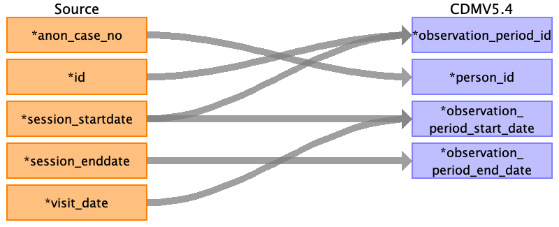

## Table name: observation_period

### Reading from pre_op__char

| Destination Field | Source field | Logic | Comment field |
| --- | --- | --- | --- |
| observation_period_id | anon_case_no |  | BEWARE anon_case_no may appear in multiple rows, representing multiple operations in a single visit session. Autogenerated unique ids |
| person_id | anon_case_no | Joined with PERSON.PERSON_SOURCE_VALUE for PERSON.PERSON_ID |  |
| observation_period_start_date | session_startdate visit_date |  | MIN date |
| observation_period_end_date | session_enddate |  | MAX date |
| period_type_concept_id |  |  | 32879	Registry |

### Reading from post_op__discharge

| Destination Field | Source field | Logic | Comment field |
| --- | --- | --- | --- |
| observation_period_id |  |  | Autogenerated unique ids |
| person_id | anon_case_no |  |  |
| observation_period_start_date |  |  | MIN date |
| observation_period_end_date | diagnosis_date |  | MAX date |
| period_type_concept_id |  |  | 32879	Registry |

### Reading from post_op__info

| Destination Field | Source field | Logic | Comment field |
| --- | --- | --- | --- |
| observation_period_id |  |  | Autogenerated unique ids |
| person_id |  |  |  |
| observation_period_start_date |  |  | MIN date |
| observation_period_end_date |  |  | MAX date |
| period_type_concept_id |  |  | 32879	Registry |

### Reading from post_op__lab_micro

| Destination Field | Source field | Logic | Comment field |
| --- | --- | --- | --- |
| observation_period_id |  |  | Autogenerated unique ids |
| person_id | anon_case_no |  |  |
| observation_period_start_date |  |  | MIN date |
| observation_period_end_date | reported_time |  | MAX date |
| period_type_concept_id |  |  | 32879	Registry |

### Reading from pre_op__lab

| Destination Field | Source field | Logic | Comment field |
| --- | --- | --- | --- |
| observation_period_id |  |  | Autogenerated unique ids |
| person_id | anon_case_no |  |  |
| observation_period_start_date | preop_lab_collection_datetime |  | MIN date |
| observation_period_end_date |  |  | MAX date |
| period_type_concept_id |  |  | 32879	Registry |

