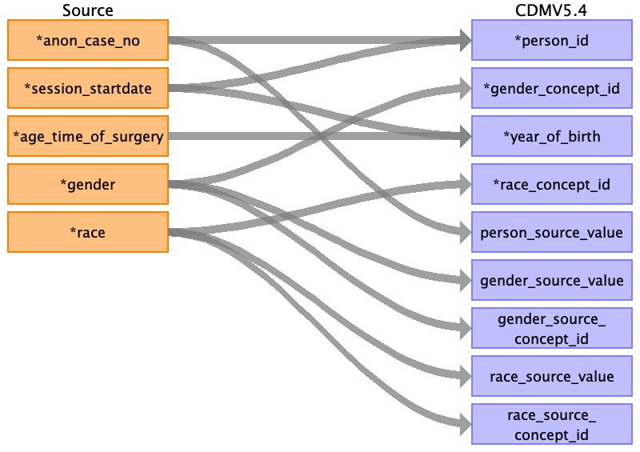

## Table name: person

### Reading from pre_op__char

| Destination Field | Source field | Logic | Comment field |
| --- | --- | --- | --- |
| person_id | session_startdate anon_case_no |  | Autogenerated unique ids, as running number by ascending order of `session_startdate` and `anon_case_no` (easy to code, but non-idempotent) |
| gender_concept_id | gender | 8532	FEMALE  8507	MALE |  |
| year_of_birth | session_startdate age_time_of_surgery | YEAR(operation_startdate) - Age_Time_of_Surgery  | Use calculation of two fields to find the birth year   |
| month_of_birth |  |  | no data |
| day_of_birth |  |  | no data |
| birth_datetime |  |  | no data |
| race_concept_id | race | 38003574	Asian Indian  38003579	Chinese  38003587	Malaysian  38003596	Singaporean | find concept_id for other races here: http://athena.ohdsi.org/search-terms/terms?domain=Race&standardConcept=Standard&page=1&pageSize=15&query=  |
| ethnicity_concept_id |  |  | This is a required field but we have no data in PASAR, so value of 0 is put here. |
| location_id |  |  | no data |
| provider_id |  |  | no GP data |
| care_site_id |  |  | no primary care site data |
| person_source_value | anon_case_no |  | Each case is considered a new patient. PASAR has no master patient table nor unique patient id.    BEWARE: `anon_case_no` is not unique. The PK of pre_op.char is `operation_id`.  |
| gender_source_value | gender |  |  |
| gender_source_concept_id | gender |  | may omit this since we don't have the master code table for gender |
| race_source_value | race |  |  |
| race_source_concept_id | race |  | may omit this since we don't have the master code table for race |
| ethnicity_source_value |  |  | no data |
| ethnicity_source_concept_id |  |  | no data |

