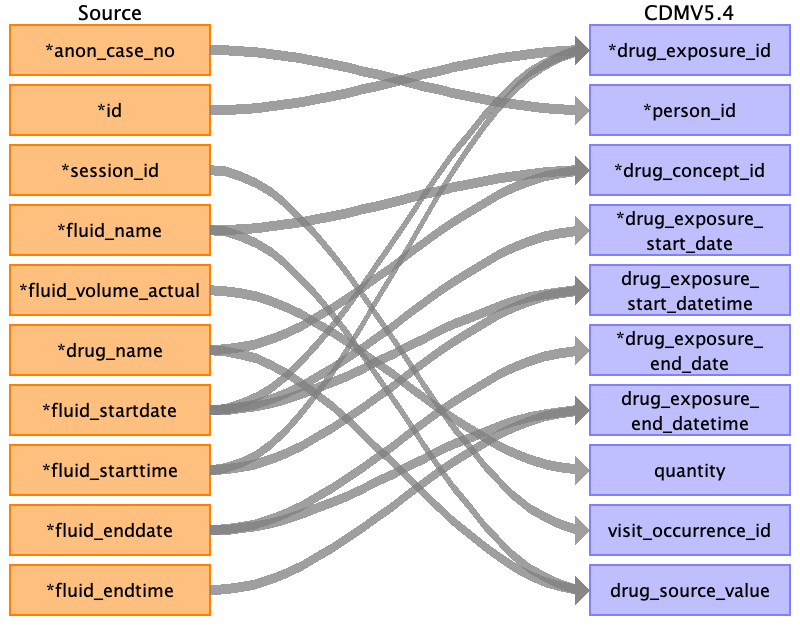

## Table name: procedure_occurrence

### Reading from intra_op__operation

| Destination Field | Source field | Logic | Comment field |
| --- | --- | --- | --- |
| procedure_occurrence_id | operation_startdate id |  |  |
| person_id | anon_case_no | Joined with PERSON.PERSON_SOURCE_VALUE for PERSON.PERSON_ID |  |
| procedure_concept_id | procedure_code | Mapped with table from Vocab team |  |
| procedure_date | operation_startdate |  |  |
| procedure_datetime | operation_starttime operation_startdate |  | concatenate from two fields |
| procedure_end_date | operation_enddate |  |  |
| procedure_end_datetime | operation_enddate operation_endtime |  | concatenate from two fields |
| procedure_type_concept_id |  |  | 32879 for Registry |
| modifier_concept_id |  |  |  |
| quantity |  |  |  |
| provider_id | anon_surgeon_name | Find provider_id from provider table |  |
| visit_occurrence_id | session_id |  |  |
| visit_detail_id |  |  |  |
| procedure_source_value | procedure_code |  |  |
| procedure_source_concept_id | procedure_code | Mapped with table from Vocab team |  |
| modifier_source_value |  |  |  |

### Reading from post_op__renal

| Destination Field | Source field | Logic | Comment field |
| --- | --- | --- | --- |
| procedure_occurrence_id | id dialysis_starttime |  |  |
| person_id | anon_case_no |  |  |
| procedure_concept_id | crrt_type |  |  |
| procedure_date | crrt_authored_date |  |  |
| procedure_datetime | dialysis_starttime crrt_authored_date |  | concatenate from two fields |
| procedure_end_date |  |  |  |
| procedure_end_datetime |  |  | concatenate from two fields |
| procedure_type_concept_id |  |  | 32879 for Registry |
| modifier_concept_id |  |  |  |
| quantity |  |  |  |
| provider_id |  |  |  |
| visit_occurrence_id |  |  |  |
| visit_detail_id |  |  |  |
| procedure_source_value | crrt_type |  |  |
| procedure_source_concept_id |  |  |  |
| modifier_source_value |  |  |  |

