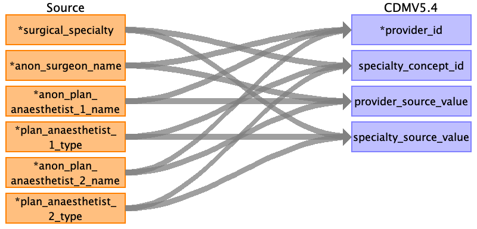

## Table name: provider

### Reading from intra_op__operation

| Destination Field | Source field | Logic | Comment field |
| --- | --- | --- | --- |
| provider_id | anon_surgeon_name anon_plan_anaesthetist_1_name anon_plan_anaesthetist_2_name | Autogenerated unique ids based on fields *_name.     This field is varchar, which needs to be converted to integer.    Suggestion: running id by alphabetical order of  `ANON_Surgeon_Name, ANON_Plan_Anaesthetist_1_Name and ANON_Plan_Anaesthetist_2_Name` (easy to code, but non-idempotent)   | Each id is considered a new surgeon/aneasthetist. PASAR has no master provider table. |
| provider_name |  |  | No data; although PASAR has field anon_surgeon_name and the likes, they are surgeon IDs not Names. |
| npi |  |  | no data |
| dea |  |  | no data |
| specialty_concept_id | surgical_specialty plan_anaesthetist_1_type plan_anaesthetist_2_type | "Obtain standard concept ID (under Provider domain) from surgical_specialty.    Gynecology -> 38003902  Orthopaedic Surgery -> 38004465  VASCULAR SURGERY -> 38004496 "Obtain standard concept ID (under Provider domain) from plan_anaesthetist_1_type and plan_anaesthetist_2_type.  Anesthesiology -> 38004450"  | For plan_anaesthetist_1_type and plan_anaesthetist_2_type, the concept id are Anesthesiology regardless the value within the fields.   |
| care_site_id |  |  | Providers should be from SGH, so only put id for SGH here |
| year_of_birth |  |  | no data |
| gender_concept_id |  |  | no data |
| provider_source_value | anon_surgeon_name anon_plan_anaesthetist_1_name anon_plan_anaesthetist_2_name | provider_source_value = ANON_Surgeon_Name provider_source_value = ANON_Plan_Anaesthetist_1_Name provider_source_value = ANON_Plan_Anaesthetist_2_Name |  |
| specialty_source_value | surgical_specialty plan_anaesthetist_1_type plan_anaesthetist_2_type | "specialty_source_value = surgical_specialty" "specialty_source_value = plan_anaesthetist_1_type" "specialty_source_value = plan_anaesthetist_2_type " | "values: Gynaecology,  Orthopaedic Surgery,  VASCULAR SURGERY,  Gastroenterology & Hepatology,  ORTHOPAEDIC SURGERY,  Colorectal Surgery,  Cardiothoracic Surgery,  Cardiology"    "value: Anesthesiology" |
| specialty_source_concept_id |  |  | no master table for specialty, may skip for now |
| gender_source_value |  |  | no data |
| gender_source_concept_id |  |  | no data |

