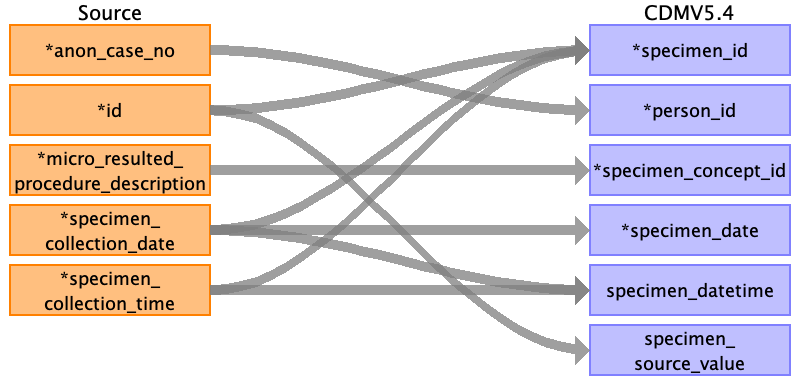

## Table name: specimen

### Reading from post_op__lab_micro

| Destination Field | Source field | Logic | Comment field |
| --- | --- | --- | --- |
| specimen_id | id specimen_collection_date specimen_collection_time |  | Autogenerated running id by ascending order of time and `id` |
| person_id | anon_case_no | Joined with PERSON.PERSON_SOURCE_VALUE for PERSON.PERSON_ID |  |
| specimen_concept_id | micro_resulted_procedure_description | Need mapping table from Vocab team |  |
| specimen_type_concept_id |  |  | 32879 for Registry |
| specimen_date | specimen_collection_date |  |  |
| specimen_datetime | specimen_collection_date specimen_collection_time |  |  |
| quantity |  |  |  |
| unit_concept_id |  |  |  |
| anatomic_site_concept_id |  |  |  |
| disease_status_concept_id |  |  |  |
| specimen_source_id |  |  |  |
| specimen_source_value | id |  |  |
| unit_source_value |  |  |  |
| anatomic_site_source_value |  |  |  |
| disease_status_source_value |  |  |  |

