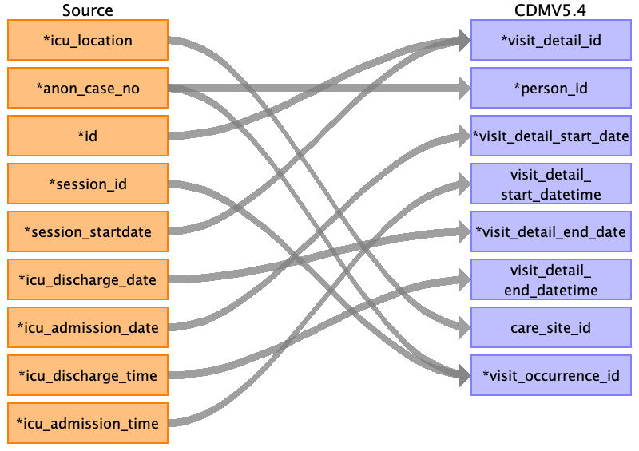
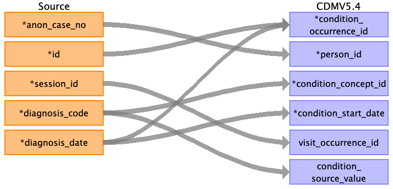

## Table name: visit_detail

### Reading from post_op__icu

| Destination Field | Source field | Logic | Comment field |
| --- | --- | --- | --- |
| visit_detail_id | id session_startdate |  | Autogenerated unique ids order by ‘session_startdate’ and ‘id’. |
| person_id | anon_case_no | Joined with PERSON.PERSON_SOURCE_VALUE for PERSON.PERSON_ID |  |
| visit_detail_concept_id |  |  | 32037 for Intensive Care |
| visit_detail_start_date | icu_admission_date |  |  |
| visit_detail_start_datetime | icu_admission_time |  |  |
| visit_detail_end_date | icu_discharge_date |  |  |
| visit_detail_end_datetime | icu_discharge_time |  |  |
| visit_detail_type_concept_id |  |  | 32879 for Registry |
| provider_id |  |  |  |
| care_site_id | icu_location | find care_site_id from care_site table |  |
| visit_detail_source_value |  |  | ICU |
| visit_detail_source_concept_id |  |  |  |
| admitted_from_concept_id |  |  |  |
| admitted_from_source_value |  |  |  |
| discharged_to_source_value |  |  |  |
| discharged_to_concept_id |  |  |  |
| preceding_visit_detail_id |  |  |  |
| parent_visit_detail_id |  |  |  |
| visit_occurrence_id | anon_case_no session_id |  | Find matching case_no and session_id in table VISIT_OCCURRENCE for their VISIT_OCCURRENCE_ID |

### Reading from intra_op__operation

| Destination Field | Source field | Logic | Comment field |
| --- | --- | --- | --- |
| visit_detail_id |  |  | Autogenerated unique ids order by ‘session_startdate’ and ‘id’. |
| person_id |  |  |  |
| visit_detail_concept_id |  |  | 32037 for Intensive Care |
| visit_detail_start_date |  |  |  |
| visit_detail_start_datetime |  |  |  |
| visit_detail_end_date |  |  |  |
| visit_detail_end_datetime |  |  |  |
| visit_detail_type_concept_id |  |  | 32879 for Registry |
| provider_id | anon_surgeon_name | On matching session_id, fill in PROVIDER_ID from PROVIDER table |  |
| care_site_id |  |  |  |
| visit_detail_source_value |  |  | ICU |
| visit_detail_source_concept_id |  |  |  |
| admitted_from_concept_id |  |  |  |
| admitted_from_source_value |  |  |  |
| discharged_to_source_value |  |  |  |
| discharged_to_concept_id |  |  |  |
| preceding_visit_detail_id |  |  |  |
| parent_visit_detail_id |  |  |  |
| visit_occurrence_id |  |  | Find matching case_no and session_id in table VISIT_OCCURRENCE for their VISIT_OCCURRENCE_ID |

