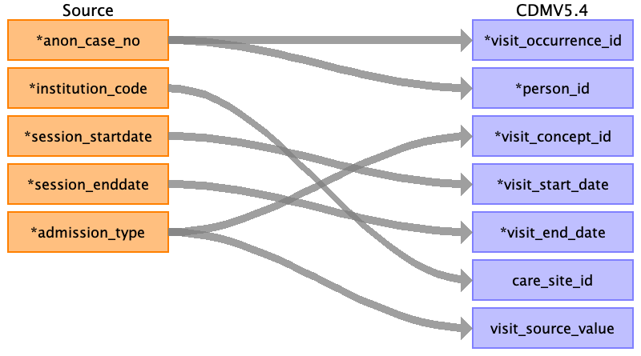
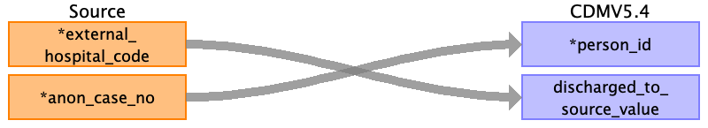

## Table name: visit_occurrence

### Reading from pre_op__char

| Destination Field | Source field | Logic | Comment field |
| --- | --- | --- | --- |
| visit_occurrence_id | session_startdate session_id |  | Use `session_id` as `visit_occurrence_id`, because `session_id` is already INTEGER. |
| person_id | anon_case_no | Joined with PERSON.PERSON_SOURCE_VALUE for PERSON.PERSON_ID | Each case is considered a new patient. PASAR has no master patient table nor unique patient id.    BEWARE: `anon_case_no` is not unique. The PK of pre_op.char is `operation_id`.  |
| visit_concept_id | admission_type | based on the admission_type , we need to fetch the concept_id    TODO: map standard concept ids | It has a value  like    Inpatient  Day Surgery (DS)  Same Day Admission (SDA)  |
| visit_start_date | session_startdate |  |  |
| visit_start_datetime |  |  |  |
| visit_end_date | session_enddate |  |  |
| visit_end_datetime |  |  |  |
| visit_type_concept_id |  |  | 32879 for Registry |
| provider_id |  |  |  |
| care_site_id | institution_code |  | Only put id for SGH here |
| visit_source_value | admission_type |  |  |
| visit_source_concept_id |  |  |  |
| admitted_from_concept_id |  |  |  |
| admitted_from_source_value |  |  |  |
| discharged_to_concept_id |  |  |  |
| discharged_to_source_value |  |  |  |
| preceding_visit_occurrence_id |  |  |  |

### Reading from post_op__discharge

| Destination Field | Source field | Logic | Comment field |
| --- | --- | --- | --- |
| visit_occurrence_id |  |  | Use `session_id` as `visit_occurrence_id`, because `session_id` is already INTEGER. |
| person_id | anon_case_no |  |  |
| visit_concept_id |  |  |  |
| visit_start_date |  |  |  |
| visit_start_datetime |  |  |  |
| visit_end_date |  |  |  |
| visit_end_datetime |  |  |  |
| visit_type_concept_id |  |  | 32879 for Registry |
| provider_id |  |  |  |
| care_site_id |  |  | Only put id for SGH here |
| visit_source_value |  |  |  |
| visit_source_concept_id |  |  |  |
| admitted_from_concept_id |  |  |  |
| admitted_from_source_value |  |  |  |
| discharged_to_concept_id |  |  |  |
| discharged_to_source_value | external_hospital_code |  |  |
| preceding_visit_occurrence_id |  |  |  |

